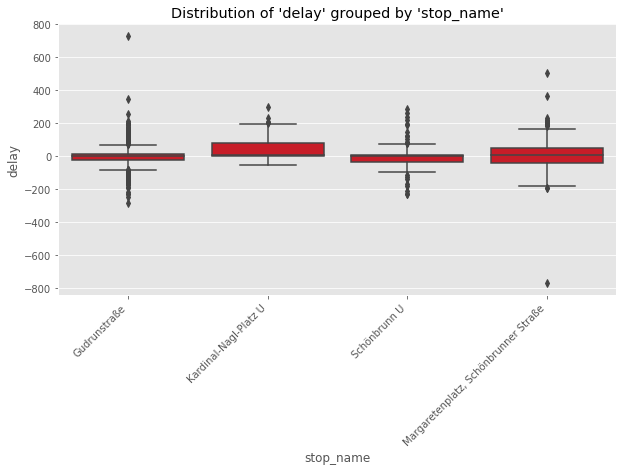

# Wiener-Linien-Project
* Author: Stefan Roland Schwingenschlögl
* email: stefan.roland.schwingenschloegl@gmail.com
___

# Overview
This is my first project here on github. As Data Source I used the Wiener Linien Realtime API (http://www.wienerlinien.at/ogd_realtime/doku/). 
This project is used to analyze delays at specific stations in Vienna's public transport network. For this analysis I chose the stations "Margeretenplatz / Schönbrunner Straße", "Kardinal-Nagl Platz", "Gudrunstraße" and "Schönbrunn". These stations are important to me because I have either lived near these places myself or I have viewed a flat there. This should give me personal information about the area relevant to me where public transport works best.

In this specific analysis I collected delay data for the four mentioned stations on 02.02.2021 from 8:16 to 22:00. This data got directly inserted into the database after calling the API. Since I have extracted the data from the API and the data ownership does not lie with me, I cannot publish the raw data. This data is only used for this analysis. The analysis is accessible in the file 'data_exploration.ipynb'.

## Technology used:
* Programming Languages: Python, SQL
* Main focus:
  - Data Collection
  - API Calls
  - Connect Python with Database
* New Libraries:
  - pyodbc (Python)
  - beautifulSoup (Python)
  - requests (Python)

## Projectflow
For the analysis, first the data on all stations and travel routes, etc. were downloaded and cleaned if necessary. In the next step, this "static" data was written into an MS SQL Server database. The database architecture was taken from the structure of the csv files.  In the next step, a script was written that automatically queries the real-time API of Wiener Linien and writes the data to a stage-delay table in the database. In the last step, the data will be analysed.

All in all the following files are in this project:

1. `set_up_structure.ipynb`: Set up folder structure and download all static files from the Wiener Linien API documentation site
2. `static_file_cleaning.ipynb`: Clean static files 
3. `create_database.ipynb`: Create a new database and all tables in SQL Server Express using pyodbc. Insert all cleaned static files into these tables
4. `API_exctraction.ipynb`: Call the Wiener Linien API once a minute, get all relevant data from the json response and write automatically into the database
5. `data_exploration.ipynb`: Data analysis of the retrieved data

# Results
In this section the results of my analysis can be seen.
After the data was queried in the API in the period already mentioned, the data was edited a little more. As no valid values of delays for metros were available, these were not included in the analysis.  
The data was queried every minute. For example, if you query at 9:00 and the next bus arrives at 9:03, you have three values in the data where only the final delay is important. Therefore, of all the planned departure times, only the last value of the delay was used.  
After these processing steps were carried out, the following result was obtained, which can be seen in the graph below.
<figure>
  
  <figcaption>This graph shows the distribution of delays in seconds of all valid means of transport of the respective stations on 02.02.2021 in the period 08:16-22:00 as a boxplot.</figcaption>
</figure>
It can be seen that at the station 'Gudrunstraße' a lot of outliers have resulted in both directions.  
At 'Kardinal-Nagl-Platz' only very few outliers can be seen, all of which only indicate delays.  
At 'Schönbrunn' there are also a few outliers in both directions. However, these are not nearly as far away from the remaining values as those at 'Gudrunstraße'.  
At the station 'Margaretenplatz, Schönbrunner Straße' it can be seen that one means of transport arrived extremely early. Furthermore, there are still some outliers in the direction of delay. Compared to the other stations, these are somewhat more widely scattered, with the exception of 'Gurdrunstraße'. 
Due to the scaling of the axes, relatively little can be said about the position of the median with this graph. Therefore, the data are summarised in a table below.

| stop_name                            | count | mean  | std   | min    | 25%   | 50% | 75%   | max   |
|--------------------------------------|-------|-------|-------|--------|-------|-----|-------|-------|
| Gudrunstraße                         | 662.0 | 1.16  | 73.85 | -286.0 | -27.0 | 0.0 | 11.75 | 728.0 |
| Kardinal-Nagl-Platz U                | 162.0 | 45.28 | 65.96 | -55.0  | 0.0   | 5.5 | 78.00 | 297.0 |
| Margaretenplatz, Schönbrunner Straße | 506.0 | 4.36  | 87.07 | -770.0 | -46.0 | 5.5 | 44.00 | 499.0 |
| Schönbrunn U                         | 169.0 | -4.36 | 71.87 | -234.0 | -38.0 | 0.0 | 5.00  | 284.0 |

All in all, the result is the following ranking:
1. **Schönbrunn U** -> The reliable solution: 
  - Span of delays: 4 minutes early to 5 minutes late
  - Best tradeoff between on-time performance and variance.
  - Range of all delays is moderate.
  - Insider-Advice: Arrive at the station at the time indicated and you will never have to wait forever for your scheduled transport.
2. **Gudrunstraße** -> The risky game:
  - Span of delays: 5 minutes early to 12 minutes late
  - Good 75%-quartile value.
  - Mean and Median Values are really good, with moderate variance.
  - Large outliers in the case of early arrival, extreme outliers in the direction of late arrival
  - Insider-Advice: If you like to play games, it's the right choice. Usually relatively punctual, but can also vary greatly. No visible trend in one direction.
3. **Kardinal-Nagl-Platz** -> Come later and it will be fine:
  - Span of delays: 1 minutes early to 5 minutes late
  - The mean Value (45 seconds) is the highest, but the median is only 5.5 seconds
  - 25% quartile is 0 seconds and 75% quartile is 78 seconds (highest)
  - Smallest Variance
  - Insider Advice: Transport is most late here. However, they are consistently late. So here you can afford to be a little late and you will still have your transport soon.
4. **Margaretenplatz, Schönbrunner Straße** -> the chaotic solution:
  - Span of delays: 10 minutes early to 8 minutes late
  - Moderate mean delay, moderate median delay
  - Highest Variance of all stops
  - Very high span of delays.
  - Insider-Advice: Like Forrest Gump's Mother would say: "Life is like a box of chocolates. You never know what you're gonna get".
